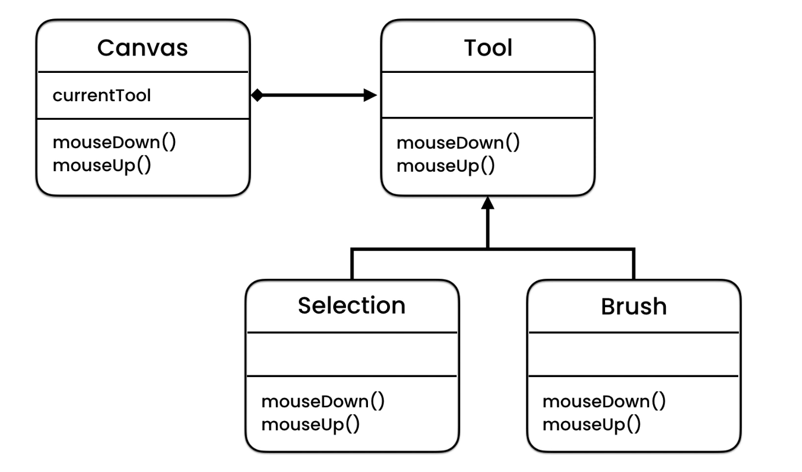

## State Pattern
The State pattern is a behavioral design pattern that allows an object to alter its behavior when its internal state changes. This pattern is useful when you have an object that needs to perform different operations based on its current state, or when you have a large number of conditional statements that are difficult to maintain.

### Implementation
The State pattern involves two main classes:

- Context: This is the object that maintains the current state and delegates the behavior to the current state object. It has a set of methods that can be used to change the state.
- State: This is an abstract class or interface that defines the behavior associated with a particular state of the Context object. It has a set of methods that the Context object can call to perform the associated behavior.

```java
public interface State {
    void doAction(Context context);
}

public class Context {
    private State state;

    public Context() {
        state = null;
    }

    public void setState(State state) {
        this.state = state;
    }

    public State getState() {
        return state;
    }

    public void doAction() {
        state.doAction(this);
    }
}

public class StartState implements State {
    public void doAction(Context context) {
        System.out.println("The object is in start state.");
        context.setState(this);
    }

    public String toString() {
        return "Start State";
    }
}

public class StopState implements State {
    public void doAction(Context context) {
        System.out.println("The object is in stop state.");
        context.setState(this);
    }

    public String toString() {
        return "Stop State";
    }
}
```
In this example, the State interface represents the different states that the Context object can be in. The Context class represents the object whose behavior changes when its state changes. The StartState and StopState classes represent the different states of the Context object.

To use this implementation of the State pattern, you can create an instance of the Context class, set its initial state to one of the states (such as StartState), call the doAction() method on the Context object, and then change the state of the Context object by calling the setState() method and passing in a new state object (such as StopState).

### Conclusion
The State pattern is a useful pattern for simplifying code that has a large number of conditional statements or for objects that need to perform different operations based on their current state. It involves two main classes: the Context class and the State class. By using these classes together, you can easily implement the State pattern in your applications.
Eg: When using a drawing application, the behavior of the application varies based on the currently selected tool. For instance, if the user chooses to use the brush tool, the behavior of the application will differ from when the eraser tool is selected.
Here the tool can be considered as a state interface and brush and eraser tool as its implementations (start and stop). Context class will be similar to a canvas where tool is selected. Sample class diagram shown below:
